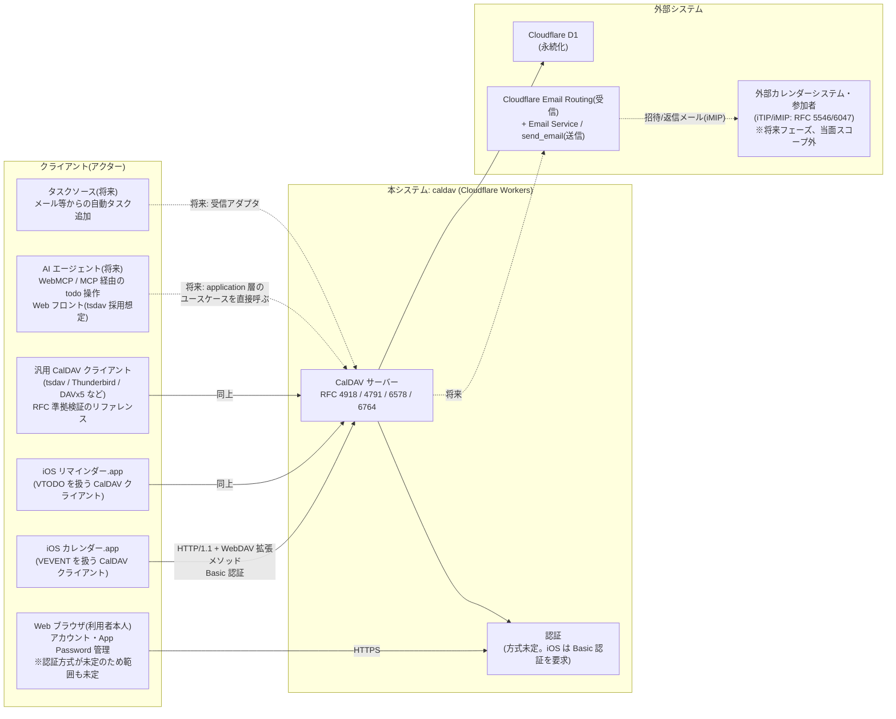

# S: システム関連図

> SUDO モデリングの「S」。このシステムが誰と・何と・どのプロトコルで関わるかを固定する図。
> コア価値は「CalDAV の RFC 準拠 + iOS 対応」なので、iOS 標準アプリを第一級のアクターとして扱う。

## アクターごとの要点(実装判断の根拠になる知識)

### iOS カレンダー / リマインダー(プライマリ)

- 両者は**同じ CalDAV アカウント設定を共有**する。1つの CalDAV アカウントを登録すると、
  カレンダーコレクションの `supported-calendar-component-set` を見て
  VEVENT のコレクションはカレンダー.app に、VTODO のコレクションはリマインダー.app に振り分けられる。
  → コレクションのコンポーネント種別はドメイン上の重要な属性(前作 hono-caldav でも `component_type` として保持していた)。
- アカウント探索は RFC 6764 (`/.well-known/caldav`) → `current-user-principal` (RFC 5397) →
  `calendar-home-set` (RFC 4791 §6.2.1) の順。この3段が通らないと iOS はアカウント追加に失敗する。
- 認証は **Basic 認証のみ**(ダイジェスト・OAuth は設定画面から使えない)。HTTPS 前提。
- Apple 独自拡張を投げてくる: `calendar-color` / `calendar-order`
  (`http://apple.com/ns/ical/`)、`getctag`(`http://calendarserver.org/ns/`)。
  RFC 外だが iOS 対応がコア価値なのでドメインモデルに含める。

### 汎用 CalDAV クライアント

- 「iOS で動く」だけでは RFC 準拠の証明にならないため、準拠検証のリファレンスとして扱う。
  前作では tsdav をテストで使用しており、本作でも同様の位置づけを想定。

### 外部カレンダーシステム(iTIP/iMIP)

- 参加者招待・出欠応答のための相手。RFC 6638(CalDAV Scheduling)/ RFC 5546(iTIP)/
  RFC 6047(iMIP: メール輸送)。**当面スコープ外**だが、ドメインモデル図には
  スケジューリングコンテキストとして輪郭だけ描いておく(後付けで歪まないように)。
- 2026-07 時点の判断: 輸送手段は Cloudflare で完結できる見込みが立った。
  受信 = Email Routing(Worker の `email()` ハンドラ)、送信 = Email Service の
  `send_email` バインディング(公式 OSS `cloudflare/agentic-inbox` が両方の実例)。
  想定ループ: iOS で参加者追加 → サーバーが iTIP 解釈(RFC 6638 の auto-schedule)→
  外部参加者へ Email Service で招待送信 → 返信メールを Email Routing で受けて PARTSTAT 更新。
  メールはあくまで輸送手段なので infrastructure 層のアダプタに閉じ、ドメインモデルには影響しない。
  制約: 送信には Email Service の有効化と自ドメインの Cloudflare 管理が前提。

### AI エージェント / タスクソース(将来・長期ビジョン)

- CalDAV サーバーを自前実装する強い動機は **agentic な todo/task 管理**。
  Web フロント(tsdav 等)+ WebMCP でのエージェント操作、メール等からのタスク自動追加を見据える。
- 重要な設計含意: これらは **DAV プロトコルを経由しない入口**になる。
  エージェントに XML の PROPFIND を書かせるのではなく、application 層のユースケース
  (「タスクを追加する」「完了にする」)を MCP ツールや REST として直接公開する。
  → application 層を presentation(DAV/XML)から独立させておく理由がコア価値以外にもう1つ増えた。

## システム境界に関する決定事項

| 決定 | 理由 |
|------|------|
| 本システムは「サーバー」であり、iCloud 等へのクライアント接続はしない | コア価値に含まれない |
| Web UI は最小限(認証情報の管理程度)、カレンダー編集 UI は作らない | 編集は iOS 標準アプリの役目。CalDAV 準拠がコア価値。将来のタスク管理フロントは tsdav 等「クライアント」として本サーバーに接続する側 |
| 認証は差し替え可能な境界として設計する | better-auth 採用が未定のため。iOS の制約(Basic 認証)だけが確定要件 |
| コアは再利用可能な「CalDAV サーバーキット」として構成する(OSS 思想) | 他プロジェクトで気軽に自前 CalDAV サーバーを建てられることを大事にする。特定ユースケースへの特化はしない。永続化(D1)・認証はアダプタとして差し替え可能に |
