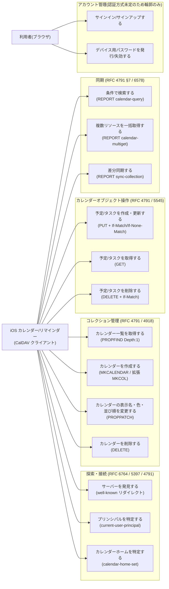

# U: ユースケース図

> SUDO モデリングの「U」。アクターがシステムで何を達成するかを列挙し、
> アプリケーション層のユースケースクラスの一覧の元ネタにする。
> CalDAV では「1 HTTP メソッド = 1 ユースケース」ではない点に注意
> (例: REPORT は中の XML によって calendar-query / calendar-multiget / sync-collection に分かれる)。

## ユースケース詳細(実装順の目安つき)

優先度は「iOS のアカウント追加 → 初回同期 → 日常操作」というクライアントの実際の挙動順。
**この順に実装すれば、常に iOS 実機で動作確認できる状態を保てる。**

### Phase A: 探索・接続(これが通らないと iOS はアカウント追加すら完了しない)

| # | ユースケース | プロトコル | 主な準拠点 |
|---|------------|-----------|-----------|
| 1 | サーバーを発見する | `GET /.well-known/caldav` → リダイレクト(301/303/307 いずれでも可。Cache-Control 推奨) | RFC 6764 §5 |
| 2 | プリンシパルを特定する | `PROPFIND /` で `current-user-principal` | RFC 5397 |
| 3 | カレンダーホームを特定する | `PROPFIND {principal}` で `calendar-home-set` | RFC 4791 §6.2.1 |
| 4 | カレンダー一覧を取得する | `PROPFIND {home}` Depth:1 | RFC 4918 §9.1 |

### Phase B: オブジェクト操作と同期(初回同期・日常の CRUD)

| # | ユースケース | プロトコル | 主な準拠点 |
|---|------------|-----------|-----------|
| 5 | 予定/タスクを作成・更新する | `PUT {home}/{cal}/{uid}.ics` | RFC 4791 §5.3.2(preconditions 多数) |
| 6 | 予定/タスクを取得する | `GET` | ETag 必須(同期の基盤) |
| 7 | 複数リソースを一括取得する | `REPORT calendar-multiget` | RFC 4791 §7.9 |
| 8 | 差分同期する | `REPORT sync-collection` | RFC 6578。Depth は 0 のみ(他は 400)、削除は 404 で報告、打ち切りは 507 + number-of-matches-within-limits |
| 9 | 予定/タスクを削除する | `DELETE` | If-Match による楽観ロック |

### Phase C: コレクション管理

| # | ユースケース | プロトコル | 主な準拠点 |
|---|------------|-----------|-----------|
| 10 | カレンダーを作成する | `MKCALENDAR` / 拡張 `MKCOL` | RFC 4791 §5.3.1 / RFC 5689。 ※前作の知見: workerd が MKCALENDAR メソッドを通さず `POST + X-Caldav-Method` プロキシで回避した。本作でも要検証 |
| 11 | 表示名・色・並び順を変更する | `PROPPATCH` | RFC 4918 §9.2 + Apple 拡張 |
| 12 | カレンダーを削除する | `DELETE {home}/{cal}/` | RFC 4918 §9.6 |
| 13 | 条件で検索する | `REPORT calendar-query` | RFC 4791 §7.8。time-range フィルタは繰り返し展開が絡む最難関 |

### Phase D: アカウント管理(認証方式決定後に確定)

- サインイン/サインアップ、デバイス用パスワード発行/失効。
- iOS 側の確定要件は「Basic 認証で通ること」のみ。ユースケースの中身は認証方式決定まで凍結。

### スコープ外(将来)

- 出欠依頼を送る/受ける(RFC 6638 CalDAV Scheduling、RFC 5546 iTIP、RFC 6047 iMIP)
- 空き時間を照会する(`REPORT free-busy-query`、RFC 4791 §7.10)
- カレンダー共有(RFC 4918 ACL / caldav-sharing は Apple 独自色が強い)
