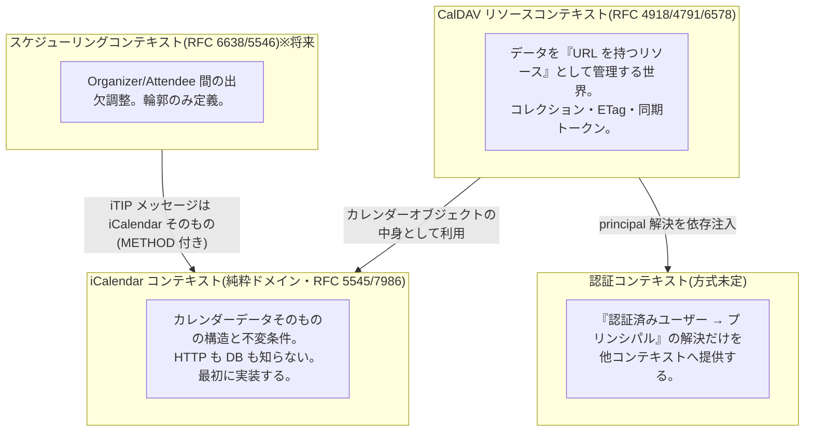
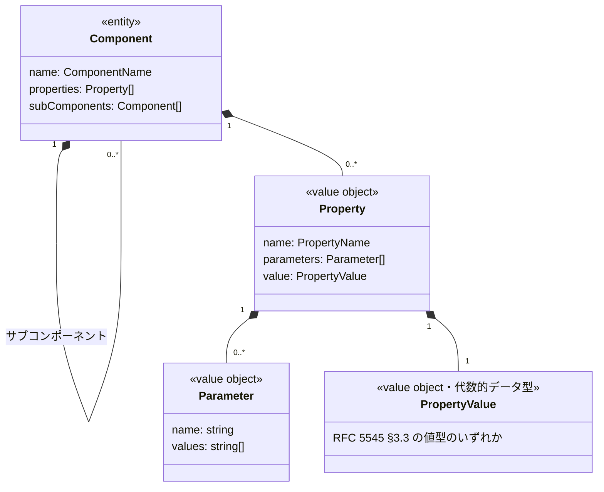
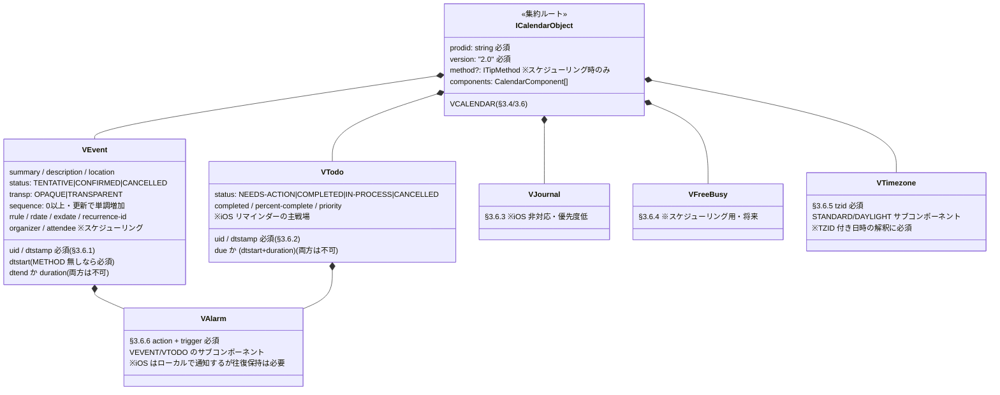
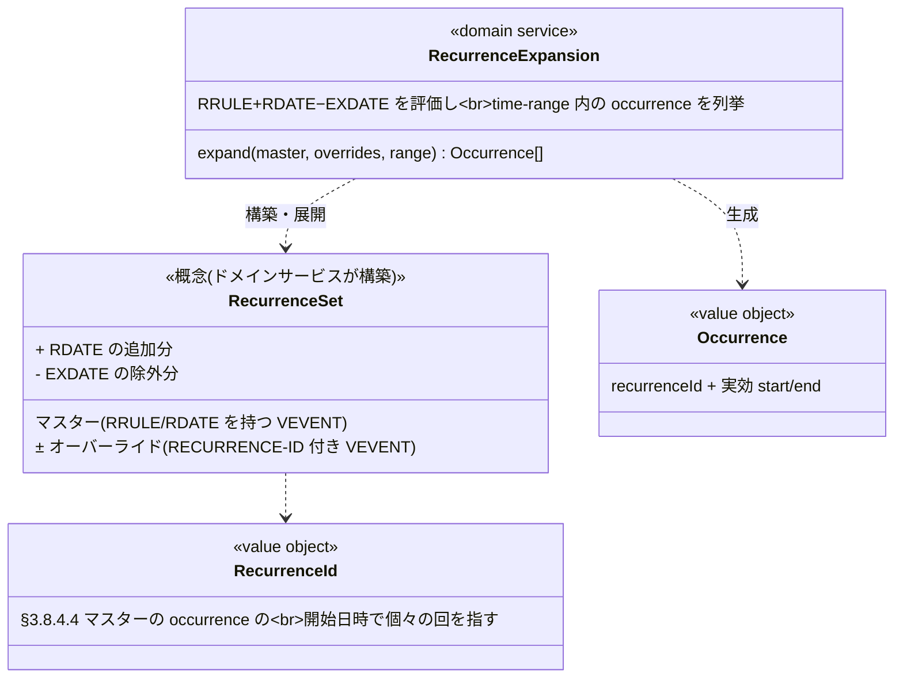

# D: ドメインモデル図

> SUDO モデリングの「D」。実装(domain 層)はこの図を正とする。
> 一次資料: RFC 5545(iCalendar)/ RFC 7986(iCalendar 拡張プロパティ)/ RFC 4791(CalDAV)/
> RFC 4918(WebDAV)/ RFC 6578(sync-collection)/ RFC 5397(current-user-principal)。
>
> 前作 hono-caldav の反省: ICS を文字列のまま保持し、UID 抽出だけ regex/ical.js で行っていたため、
> iCalendar の豊かな概念(コンポーネント階層・プロパティ・値型・繰り返し)が型として存在しなかった。
> 本作ではそれらを第一級のドメインオブジェクトにする。

## 境界づけられたコンテキスト



- **コンテキスト間の関係**: iCalendar コンテキストが最も内側(共有カーネルではなく、
  CalDAV コンテキストが「順応者」として利用する)。iCalendar のモデルは CalDAV の都合
  (URL、ETag 等)を一切含めないこと。
- 認証コンテキストはインターフェース(`PrincipalResolver` 相当)だけ先に切り、実装は保留。

---

## 1. iCalendar コンテキスト(RFC 5545)

### 1-1. 構造の骨格: コンポーネント / プロパティ / パラメータ / 値

RFC 5545 のデータモデルは徹底して「汎用構造+意味論」の二層になっている。
これをそのままモデルに写す。**汎用構造の層(§3.1〜3.2)が可逆性(ロスレス往復)を担保し、
意味論の層(§3.6〜3.8)が型安全なアクセスと不変条件を担保する**、という役割分担。



**設計決定: ロスレス往復(round-trip)を最優先の不変条件にする。**
これは設計趣味ではなく RFC の要求: RFC 4791 §5.3.3 は非標準(X-)コンポーネント/プロパティ/
パラメータの格納を MUST サポートとし、RFC 5545 §3.6 も「未知コンポーネントを黙って捨てるのは
データ喪失につながる(SHOULD NOT drop)」と明記する。さらに §5.3.4 により、サーバーが
データを書き換えると PUT 応答で ETag を返せなくなる(MUST NOT)ため、同期効率にも直結する。
iOS は `X-APPLE-*` プロパティを大量に付けてくるため、未知のプロパティ・パラメータも
汎用構造(`Property`)のまま保持し、**捨てない・並べ替え以外の改変をしない**。
型付きの意味論レイヤーは、この汎用構造の上に「レンズ」としてかぶせる
(例: `VEvent.dtstart` は内部の `Property("DTSTART")` を読み書きする型付きアクセサ)。

### 1-2. 値オブジェクト(RFC 5545 §3.3 の値型)

前作に一切存在しなかった層。ここが「多種多様なドメインモデル」の本体。

```mermaid
classDiagram
    class CalDateTime {
        <<value object>>
        RFC 5545 §3.3.5
        3形態: ①ローカル(floating)<br/>②UTC(...Z)<br/>③TZID 付きローカル
    }
    class CalDate {
        <<value object>>
        §3.3.4 VALUE=DATE(終日)
    }
    class DurationValue {
        <<value object>>
        §3.3.6 例 P1DT12H。<br/>符号あり。週指定と日時指定は排他
    }
    class PeriodValue {
        <<value object>>
        §3.3.9 開始/終了 or 開始/期間
    }
    class RecurrenceRule {
        <<value object>>
        §3.3.10 FREQ 必須。<br/>UNTIL と COUNT は排他。<br/>BYxxx 群の相互作用が最難関
    }
    class CalAddress {
        <<value object>>
        §3.3.3 mailto: URI が基本
    }
    class UtcOffset {
        <<value object>>
        §3.3.14 VTIMEZONE で使用
    }
    class TextValue {
        <<value object>>
        §3.3.11 エスケープ規則<br/>(\\n \\, \\; \\\\)を内包
    }
```



- **`CalDateTime` の3形態は iCalendar 最大の落とし穴**。
  「2026-07-08T09:00 floating」「2026-07-08T00:00Z」「TZID=Asia/Tokyo の 09:00」は
  別物であり、比較・展開時の意味が違う(RFC 4791 §7.8 time-range フィルタや RRULE 展開で効いてくる)。
  3形態を1つの Date 型に潰さず、判別可能なユニオンで表現する。
- `RecurrenceRule` は値オブジェクトだが、その**展開**(occurrence の列挙)はロジックが重いので
  ドメインサービス `RecurrenceExpansion` に分離する(後述)。

### 1-3. コンポーネントの意味論レイヤー(RFC 5545 §3.6)



**主要な不変条件(コンストラクタ/ファクトリで強制する)**

<!-- 2026-07-08 RFC 5545 原文照合済み(詳細は 05-rfc-verification.md)。
     I6/I7 は初版から訂正(SHOULD→MUST、UNTIL の UTC 強制、significant revision)。 -->

| # | 不変条件 | 根拠 |
|---|---------|------|
| I1 | VCALENDAR は `VERSION:2.0` と `PRODID` を持つ | RFC 5545 §3.6 |
| I2 | VEVENT/VTODO は `UID` と `DTSTAMP` を必ず持つ。`DTSTAMP` は UTC 形式 MUST | §3.6.1/§3.6.2/§3.8.7.2 |
| I3 | VEVENT の `DTEND` と `DURATION` は同時に存在しない。`DTEND` は `DTSTART` より後(同時刻も不可・MUST) | §3.6.1/§3.8.2.2 |
| I4 | VTODO の `DUE` と `DURATION` は同時に存在しない(`DURATION` には `DTSTART` 必須) | §3.6.2 |
| I5 | `RRULE` の `UNTIL` と `COUNT` は同時に指定できない。`FREQ` は必須で生成時は先頭に置く | §3.3.10 |
| I6 | `DTEND`/`DUE`/`RECURRENCE-ID` の値型は `DTSTART` と一致(MUST)。`UNTIL` は `DTSTART` が DATE なら DATE、**DATE-TIME(UTC/TZID 付き)なら UTC 形式**(TZID 付き UNTIL は存在しない) | §3.3.10/§3.8.2/§3.8.4.4 |
| I7 | `SEQUENCE` は organizer の「重要な改訂(significant revision)」ごとに単調増加、初期値0。繰り返しインスタンスごとに異なる値を持ちうる | §3.8.7.4 |
| I8 | TZID パラメータ付き日時は、参照する VTIMEZONE が同じ VCALENDAR 内に存在する(TZID ごとに MUST)。TZID は UTC 値(Z付き)と DATE 型に付けては MUST NOT | §3.2.19/§3.3.5 ※iOS は必ず VTIMEZONE を同梱してくる |
| I9 | DATE 型 `DTSTART` のとき RRULE の `BYSECOND`/`BYMINUTE`/`BYHOUR` は不可(違反時は無視 MUST)。DATE 型イベントの `DURATION` は日/週単位のみ | §3.3.10/§3.6.1 |
| I10 | VTIMEZONE は `TZID` 必須 + STANDARD / DAYLIGHT の**少なくとも1つ**(各複数可)。各サブコンポーネントは DTSTART/TZOFFSETTO/TZOFFSETFROM 必須 | §3.6.5 |

上記以外の細則(行折り畳み、TEXT エスケープ、COUNT のセマンティクス、RDATE の PERIOD 値型など)は
[05-rfc-verification.md](05-rfc-verification.md) に一覧がある。実装時はそちらを必ず参照。

### 1-4. 繰り返し(recurrence)のモデル — 最重要・最難関



- 「毎週の会議の、来週だけ時間変更」は、**同一 UID の VEVENT が同一 VCALENDAR 内に複数並ぶ**
  (マスター1つ + `RECURRENCE-ID` 付きオーバーライド n 個)形で表現される(RFC 5545 §3.8.4.4)。
  → CalDAV リソースの不変条件 R3(後述)「1リソース内の全コンポーネントは同一 UID」はこのためにある。
- RRULE 展開は RFC 4791 §7.8 の time-range フィルタ(calendar-query)で必須になる。
  **Phase B の calendar-multiget / sync-collection だけなら展開不要**なので、実装を後ろに送れる。
  この依存関係が docs/modeling/02-usecases.md の実装順(multiget/sync を query より先)の根拠。

---

## 2. CalDAV リソースコンテキスト(RFC 4918/4791/6578)

「iCalendar データを URL を持つリソースとして出し入れする」世界。集約は3つ。

```mermaid
classDiagram
    class Principal {
        <<集約ルート>>
        RFC 5397 / 4791 §6.2
        principalPath(URL 上の同一性)
        calendarHomeSet: URL
        ※認証コンテキストが解決した<br/>ユーザーと1:1
    }
    class CalendarCollection {
        <<集約ルート>>
        RFC 4791 §4.2
        id(URL セグメントの元)
        owner: PrincipalRef
        displayName: string
        supportedComponents: ComponentKind[] ※VEVENT/VTODO
        color?: AppleColor ※Apple拡張
        order?: number ※Apple拡張
        ctag: CTag ※CalendarServer拡張
        syncToken: SyncToken
    }
    class CalendarObjectResource {
        <<集約ルート>>
        RFC 4791 §4.1
        uri(コレクション内で一意・例 {uid}.ics)
        etag: ETag
        payload: ICalendarObject ※iCalendar コンテキストの集約
        componentKind: VEVENT|VTODO
    }
    class SyncChange {
        <<entity(CalendarCollection 集約内)>>
        RFC 6578
        uri + 変化種別(created|modified|deleted)
        + その時点の syncToken
    }
    class SyncToken {
        <<value object>>
        クライアントには不透明だが<br/>有効な URI であることが MUST(RFC 6578 §3.2)
        ※前作の裸の整数は厳密には違反。<br/>内部は整数カウンタ+公開時に URI 化する
    }
    class ETag {
        <<value object>>
        RFC 7232。内容が変われば必ず変わる
        ※前作は ICS の SHA-256。踏襲候補
    }
    Principal "1" --> "0..*" CalendarCollection : calendar-home 配下
    CalendarCollection "1" --> "0..*" CalendarObjectResource : 参照(ID 参照)
    CalendarCollection "1" *-- "0..*" SyncChange : 変更ログ
    CalendarObjectResource "1" *-- "1" ICalendarObject
```

**集約の境界に関する設計決定**

- `CalendarCollection` と `CalendarObjectResource` は**別集約**にする(コレクション集約が
  全オブジェクトを抱えると、数千件のカレンダーで集約が巨大化する)。
  相互参照は ID(URI)で行う。
- ただし「オブジェクトの PUT/DELETE 時に、コレクションの syncToken/ctag を進めて
  SyncChange を記録する」という**集約横断の整合性**が必要。
  → アプリケーション層のユースケースが両集約を1トランザクション(D1 batch)で更新する。
  ドメインイベントを導入するかは実装時に判断(Workers 環境では同期処理で十分な可能性が高い)。

**リソースの不変条件(RFC 4791 §4.1 と §5.3.2.1 preconditions)**

<!-- 2026-07-08 RFC 4791 原文照合済み(詳細は 05-rfc-verification.md)。
     R1 の根拠訂正・R4 の上書き禁止追加・R6 の任意深さ化・R7(METHOD 禁止)追加。 -->

| # | 不変条件 | 根拠・対応するエラー |
|---|---------|--------------------|
| R1 | コンポーネント種別は1種類のみ(VTIMEZONE 除く)。「VCALENDAR は1つ」の明文は §4.1 に無く §9.6(calendar-data は単数)由来の暗黙前提 — 実装としては強制する | §4.1/§9.6 / precondition `valid-calendar-object-resource` |
| R2 | コレクションの `supportedComponents` に合う種別しか置けない(プロパティ不在時は全種別受理 MUST) | §5.2.3 / precondition `supported-calendar-component` |
| R3 | リソース内の全コンポーネント(VTIMEZONE 除く)は同一 UID | §4.1(recurrence オーバーライドのため) |
| R4 | 同一コレクション内で UID は重複しない。**既存リソースを別 UID で上書きすることも不可**(= PUT 更新で UID 変更不可)。エラー時は衝突相手の URL を href で返す SHOULD | §4.1/§5.3.2.1 / precondition `no-uid-conflict` → 403/409 |
| R5 | 全リソースで**強い ETag** を持つ(MUST)。PUT 応答で ETag を返せるのは格納データが送信ボディとオクテット等価な場合のみ(サーバーが書き換えたら返しては MUST NOT)。If-Match 不一致は 412 | §5.3.4 / RFC 7232 ※ロスレス往復設計なら常に返せる — この設計の RFC 上の実利 |
| R6 | カレンダーコレクションは**任意の深さで**ネスト不可(直下だけではない)。直下の非コレクションはカレンダーオブジェクトリソースのみ | §4.2 |
| R7 | リソースは iCalendar の `METHOD` プロパティを含んでは MUST NOT(METHOD 付き = iTIP メッセージは通常コレクションに入らない) | §4.1 / precondition `valid-calendar-object-resource` |

PUT の precondition は全11個ある(max-resource-size / min-date-time / max-instances 等)。
一覧と、calendar-data が WebDAV プロパティではない(REPORT 応答専用)こと、
multiget が Depth を無視することなどの細則は [05-rfc-verification.md](05-rfc-verification.md) を参照。

### PROPFIND / REPORT のモデル上の位置づけ

- WebDAV プロパティ(`displayname`, `resourcetype`, `getetag`, `getctag`, …)は
  「集約の状態をプロトコル語彙に写像したビュー」であり、ドメインオブジェクトではない。
  **presentation 層の関心事**とし、`PropertyName → 集約の属性` のマッピング表として実装する。
  (前作はこの写像が xml.ts とハンドラに散らばっていた。)
- REPORT の3種(calendar-query / calendar-multiget / sync-collection)は
  それぞれ独立したユースケース。フィルタ(`comp-filter`/`time-range`)の**評価**だけは
  iCalendar コンテキストのドメインサービス(RecurrenceExpansion 等)を使う。

---

## 3. スケジューリングコンテキスト(将来・輪郭のみ)

実装しないが、後付けで歪まないよう概念の位置だけ決めておく。

- `ITipMessage`: METHOD(REQUEST/REPLY/CANCEL/…)付きの ICalendarObject(RFC 5546)。
- `Organizer` / `Attendee`(PARTSTAT: NEEDS-ACTION/ACCEPTED/DECLINED/…)は
  iCalendar コンテキストのプロパティとして既に往復保持される(汎用構造のおかげで実装不要)。
- `ScheduleInbox` / `ScheduleOutbox`: RFC 6638 §2 の特殊コレクション。
  CalDAV リソースコンテキストのコレクションの一種として将来追加する。

---

## 4. 認証コンテキスト(方式未定・インターフェースのみ)

- 提供するものは1つ: **「HTTP リクエストの資格情報 → Principal」の解決**。
- iOS の確定要件は Basic 認証のみ。better-auth / App Password / 単純な資格情報テーブル、
  いずれになっても CalDAV 側は `PrincipalResolver` インターフェース越しにしか触れない。

---

## 用語集(ユビキタス言語)

| 用語 | 意味 | 由来 |
|------|------|------|
| カレンダーオブジェクト | VCALENDAR 全体(1リソースの中身) | RFC 4791 §4.1 |
| コンポーネント | VEVENT/VTODO 等、BEGIN...END のブロック | RFC 5545 §3.6 |
| プロパティ | コンポーネント内の1行(名前+パラメータ+値) | RFC 5545 §3.5 |
| コレクション | カレンダー(オブジェクトを入れる器) | RFC 4791 §4.2 |
| プリンシパル | 認証されたユーザーの DAV 上の表現 | RFC 3744/5397 |
| occurrence | 繰り返し予定の個々の回 | RFC 5545 §3.8.5 |
| マスター / オーバーライド | 繰り返しの元定義 / RECURRENCE-ID で上書きされた回 | RFC 5545 §3.8.4.4 |
| sync token | 差分同期の基準点を示す不透明な値 | RFC 6578 |
| ctag | コレクション全体の変更検知タグ(getctag) | CalendarServer 拡張(非RFC) |
