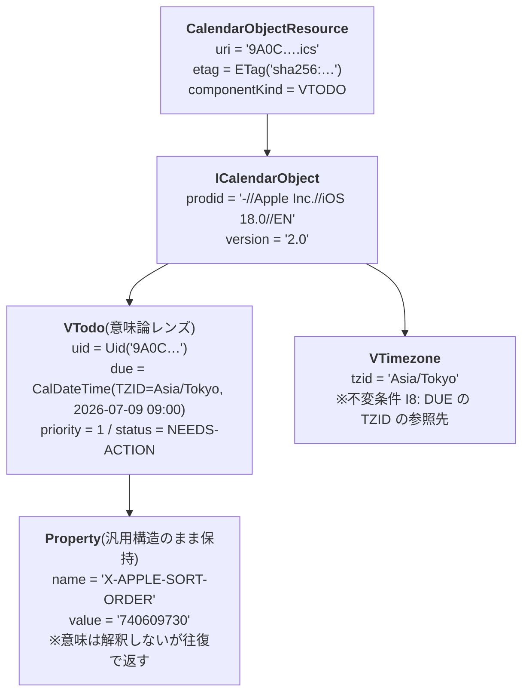
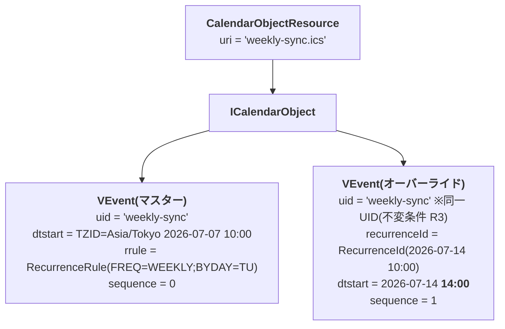
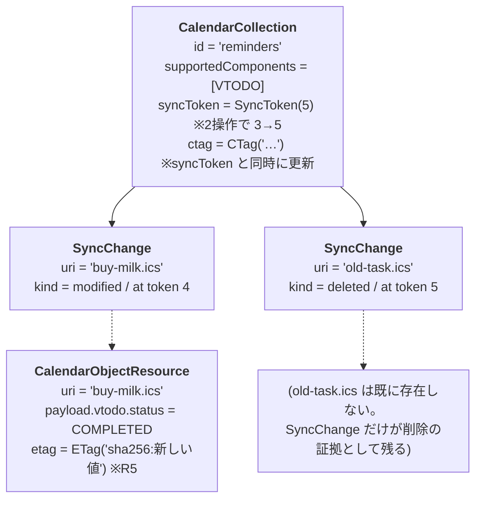
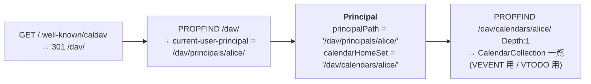

# O: オブジェクト図

> SUDO モデリングの「O」。ドメインモデル図(03)の妥当性を、具体的なインスタンスで検証する図。
> 「モデルが実データを表現できるか」をここで確かめてから実装に入る。
> 題材は iOS 実機が実際に送ってくるデータに寄せている(前作の E2E テストで観測済みのパターン)。

## ケース1: iOS リマインダーが作った期限付きタスク

iOS リマインダーで「牛乳を買う(明日期限・優先度高)」を作ると、おおよそ次の ICS が PUT される:

```
BEGIN:VCALENDAR
VERSION:2.0
PRODID:-//Apple Inc.//iOS 18.0//EN
BEGIN:VTODO
UID:9A0C…-….ics
DTSTAMP:20260708T001000Z
DUE;TZID=Asia/Tokyo:20260709T090000
SUMMARY:牛乳を買う
PRIORITY:1
STATUS:NEEDS-ACTION
X-APPLE-SORT-ORDER:740609730
END:VTODO
BEGIN:VTIMEZONE
TZID:Asia/Tokyo
…
END:VTIMEZONE
END:VCALENDAR
```



**検証ポイント**: `X-APPLE-SORT-ORDER` のような未知プロパティが、型付きレンズ(`VTodo`)の
下にある汎用構造(`Property`)として生き残ること。これが表現できないモデルは iOS 対応で破綻する。

## ケース2: 繰り返し予定+1回だけ時間変更(同一 UID の複数コンポーネント)

「毎週火曜 10:00 の定例。ただし 7/14 の回だけ 14:00 に変更」。
1つのリソース(1 UID)に VEVENT が **2つ** 入る — マスターとオーバーライド。



`RecurrenceExpansion.expand(master, [override], 7月の範囲)` の結果:

| occurrence | recurrenceId | 実効 start | 出どころ |
|-----------|--------------|-----------|---------|
| 1 | 07-07 10:00 | 07-07 10:00 | マスターの RRULE 展開 |
| 2 | 07-14 10:00 | **07-14 14:00** | オーバーライドが差し替え |
| 3 | 07-21 10:00 | 07-21 10:00 | マスターの RRULE 展開 |

**検証ポイント**: 「同一 UID のコンポーネントが複数」はモデル上の異常ではなく正規の状態。
`recurrenceId` の有無でマスター/オーバーライドを判別できる。

## ケース3: sync-collection による差分同期(集約横断の整合性)

初回同期後(syncToken=3)に、iOS がタスクを1件完了にし(PUT)、1件削除(DELETE)した状態:



クライアントが token 3 の sync-token で REPORT すると: `buy-milk.ics`(200 + 新 etag)と
`old-task.ics`(**404**)が返り、token 5 を表す新しい sync-token を受け取る。
※RFC 6578 §3.2 原文照合済み — 削除済みメンバーのステータスは 404(前作の 410 は誤りと確定)。
※sync-token の公開形式は URI であることが MUST(§3.2)。内部整数 5 は
`https://{host}/ns/sync/5` のような URI にラップして返す。初回同期は「空の DAV:sync-token 要素」。

**検証ポイント**: 「PUT/DELETE の1操作 = syncToken の1増分 + SyncChange 1件 + ctag 更新」が
アプリケーション層の1トランザクションで成立すること(集約横断整合性の設計決定の確認)。

## ケース4: iOS のアカウント追加時の探索(Principal まわり)



**検証ポイント**: Principal は認証コンテキストが解決したユーザーと 1:1 で、
CalDAV コンテキストからは URL(principalPath)と calendarHomeSet しか見えない。
認証方式(better-auth か否か)がこの図に一切現れないことを確認。
